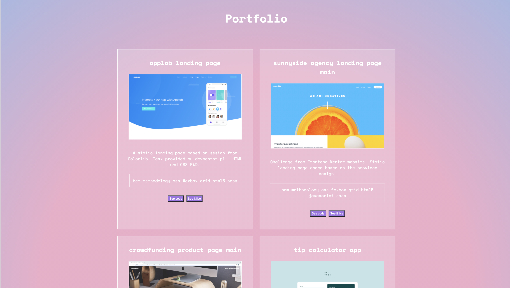

# devmentor.pl - Javascript: Testing

## Table of contents

-   [Overview](#overview)
    -   [The challenge](#the-challenge)
    -   [Screenshot](#screenshot)
-   [My process](#my-process)
    -   [What I learned](#what-i-learned)
    -   [Useful resources](#useful-resources)
-   [Author](#author)
-   [Acknowledgments](#acknowledgments)

## Overview

### The challenge

The goal was to create an app similar to Client or SDK for GitHub API (a library that will make it easier to manage it). The way I had to code it was using [TDD](https://en.wikipedia.org/wiki/Test-driven_development) which means first to create the test and only then to code the functionality.

I coded a GitHubSDK class that uses GitHub API to get information about repositories. As an additional challenge, I created a template for the portfolio which includes selected repositories from my GitHub, and displaying them. Because it is impossible to get any screenshots of the page without the backend part I decided to add miniatures of the websites as images manually.

GitHubSDK class can:

-   check how many commits were done at a particular repository,
-   check when the repository was last updated,
-   get all data about the project,
-   get data about all projects.

All first three can be achieved by passing the name of the project to GitHubSDK method.

### Screenshot

## My process

### What I learned

I learned that [GitHub API](https://docs.github.com/en/rest) exists and how to use it. I learned about API keys/tokens and how to use them for authentication. But the most important was to test my skill after learning about TDD process. In addition, I learned about config.js files and how to store secret pieces of information.

### Useful resources

-   [devmentor.pl](https://devmentor.pl/) - thanks for my mentor for providing me materials about testing for study and all excercises.
-   [GitHub API Docs](https://docs.github.com/en/rest)

## Author

-   Github - [Axseinga](https://github.com/axseinga)
-   Frontend Mentor - [@Axseinga](https://www.frontendmentor.io/profile/axseinga)
-   LinkedIn - [@Agnieszka Urbanowicz](https://www.linkedin.com/in/agnieszka-urbanowicz-051147151/)

## Acknowledgments

Thanks to my [Mentor - devmentor.pl](https://devmentor.pl/) - for providing me with this task and for code review.
